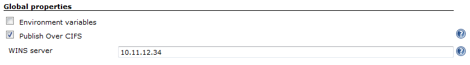
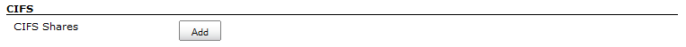
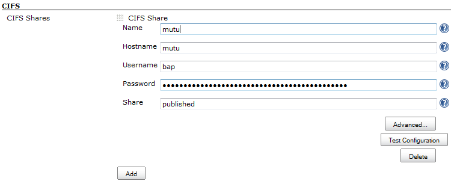
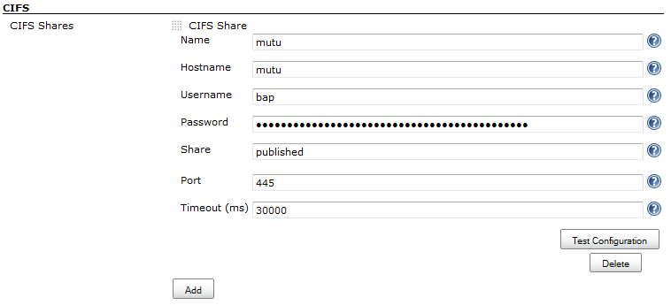
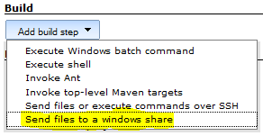
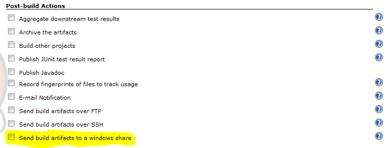
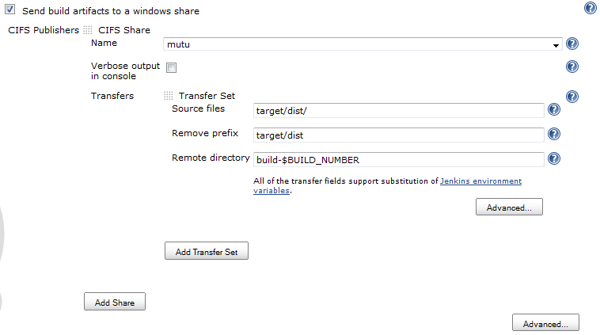
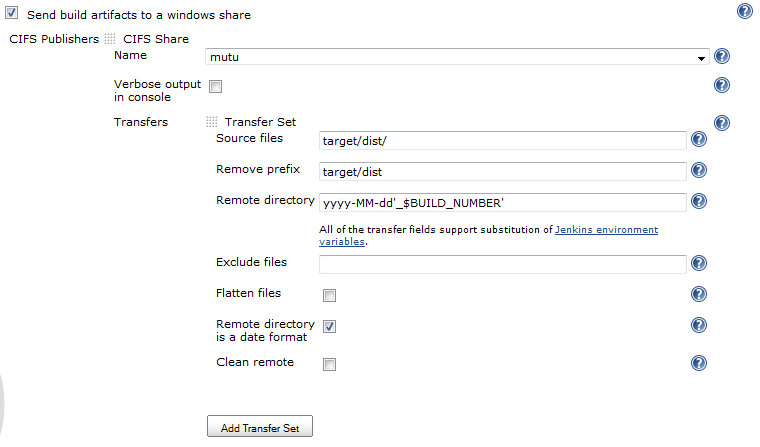
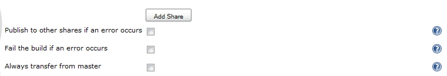
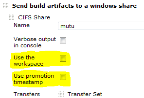

Send build artifacts to a windows share (CIFS/SMB/samba)

# Publish Over ...

Please read [Publish Over](https://plugins.jenkins.io/publish-over/) first.  
Common configuration options that are documented in the [Publish Over ... page](https://plugins.jenkins.io/publish-over/) will not be repeated here.

[Features](https://plugins.jenkins.io/publish-over/#overview)

[Configure](https://plugins.jenkins.io/publish-over/#configuration)

# Features

-   Send files to windows shares
-   The plugin is "promotion aware" see
    [Promotions](https://plugins.jenkins.io/publish-over/#promotions)
-   Publish to multiple shares in the "Post-build Actions"
-   Passwords are encrypted in the configuration files and in the UI
-   Copy files to a windows share during a build

# Configure

## Configure a WINS server

From the Jenkins home page, click "Manage Jenkins" and then click on "Configure System"

In the main Jenkins configuration page, there will be a "Publish Over CIFS" checkbox in the "Global properties" section.

## WINS server

Set this option to the IP address of a WINS server that will be used by the Jenkins controller, and will be the default for all other agents.

The WINS server can be set or overridden for individual agents

A "Publish Over CIFS" checkbox will appear under "Node Properties" in the configuration for a node.  
Set the WINS server to an IP address that this node will use for name
resolution.

If a default WINS server has been specified in the "Global properties", a node can be configured to not use WINS by checking the "Publish Over CIFS" property and leaving the WINS server empty.

## Create host configurations in the main Jenkins configuration

From the Jenkins home page, click "Manage Jenkins" and the click on "Configure System"

Find the CIFS section (as below) and click on the "Add" button next to "CIFS Servers"

You should now have the configuration options as below

Fill in Name, Hostname, Username, Password and Share. see Publish Over ... for [common options for Host
Configurations](https://plugins.jenkins.io/publish-over/#host)

### Hostname

Hostname is the hostname, IP address or windows servername of the host that contains the share

### Username

To specify a user in a specific windows domain, use a back slash to separate eg `MYDOMAIN\myuser`

### Share

The share is equivalent to the standard Remote directory option, except that the Share is required and there is no concept of the directories being relative.

The share must be, or begin with, a windows share name on the server named in Hostname.

### Advanced

If you click the "Advanced..." button for a configuration, then you will make more configuration options available (see below)

see Publish Over ... for [common options for Host Configurations](https://plugins.jenkins.io/publish-over/#host)

## Click "Test Configuration".

## Add more server configurations (if required)

# Save

## Send files to a windows share during a build

This plugin adds a build step to enable you to send files to a windows share during a build.

Select "Send files to a windows share" from the "Add build step" drop down (pic below) and then configure just like [Configure a job to send files to a windows share](#configure-a-job-to-send-files-to-a-windows-share)

![]
below

# Configure a job to send files to a windows share

Open a jobs main page and then click "Configure" from the left hand menu.

Find the "Send build artifacts to a windows share" checkbox in the "Post-build Actions" section and click in the box.

You should now have the configuration options as below

see Publish Over ... for [common options for Server](https://plugins.jenkins.io/publish-over/#server)

[see Publish Over ... for common options for Transfer Sets](https://plugins.jenkins.io/publish-over/#transfer-set)

Source files

The build will fail if you do not select any Source files to transfer

## Advanced (Transfer Sets)

If you click the "Advanced..." button for a Transfer Set, then you will make more configuration options available (see below)  

[see Publish Over ... for common options for Transfer
Sets](https://plugins.jenkins.io/publish-over/#transfer-set)

## Clean remote

Delete all files and directories from the remote directory before uploading the new files.

## Advanced (Publisher)

If you click the "Advanced..." button that is immediately below the "Add Server" button, then you will make more configuration options available (see below)

[see Publish Over ... for common options for
Publisher](https://plugins.jenkins.io/publish-over/#publisher)

# Options to override the default Promotion behaviour

If you are configuring an action in a promotion, new options will become available.  

[see Publish Over ... for common options for Promotions](https://plugins.jenkins.io/publish-over/#promotions)

# Change log

#### 0.11 (2018-07-30)

-   [Fix security
    issue](https://jenkins.io/security/advisory/2018-07-30/#SECURITY-975)

#### 0.9

-   Fixed issue with parameter verification using incorrect check urls
-   Fixed issue with bufferSize not being set correctly on ugprade
    ([issue
    49010](https://issues.jenkins.io/browse/JENKINS-49010))  
      

# Questions, Comments, Bugs and Feature Requests

Please post questions or comments about this plugin to the [Jenkins User mailing list](http://www.jenkins.io/content/mailing-lists).

To report a bug or request an enhancement to this plugin please [create a ticket in JIRA](https://www.jenkins.io/participate/report-issue/redirect/#15850).